# User Manual

PodViking Online Order Form and Dashboard

***

 

- [Getting Started](#getting-started)
    - [User Definitions](#user-definitions)
    - [Site User Registration](#site-user-registration)
    - [Logging in](#logging-in)
    - [Password Reset](#password-reset)

 

- [Orders Workflow](#orders-workflow)
    - [Contract Advisors](#contract-advisors)
    - [Helpdesk Users](#helpdesk-users)
    - [Professional Practice](#professional-practice)
    - [OCC Health Lead](#occ-health-lead)

 

- [Orders](#orders)
    - [Create an order](#create-an-order)
    - [Create an order (on Behalf of a Site User)](#create-an-order-(on-behalf-of-a-site-user))
    - [View an order](#view-an-order)
    - [Edit an order](#edit-an-order)
    - [Approve an order](#approve-an-order)
    - [Deny an order](#deny-an-order)

 

***

# Getting Started

## User Definitions

Before we dig into how to use the application it's important to understand what level of user you are. There are two levels of user in the app:

1. Site user
2. Admin user
    
    Examples of admin users are:

    2.1. Contract Advisor 
    2.2. Helpdesk 
    2.3. Professional Practice 
    2.4. OCC Health Lead 

If you are an Admin user and don't already have credentials for the application please email [help@blastramp.com](mailto:help@blastramp.com) to request your username and password.

If you are a site user wanting to place an order and you haven't registered yet, follow the site user registration instructions below.

If you are a site user returning to the site and want to place an order, follow the logging in instructions below.

## Site User Registration

To use the site a user needs to register first via the user registration form. To access the form:

1. Go to podviking.blastramp.com
2. Click on the SIGN UP link at the top right of the form

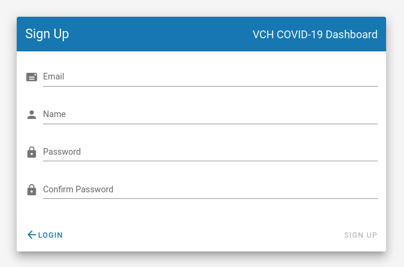

1. Enter email, name, password and confirm password
2. Click on the SIGN UPoption (bottom right)
3. Go to your inbox, you should receive an email from [notifications@ordermarshal.com](mailto:notifications@ordermarshal.com) titled 'Confirm instructions'
4. If you can't find the email in your inbox please check your spam folder
5. Once you locate the email follow the link in the body of the message where it says 'Confirm my account'
6. This will take you to confirmation page which will then log you into the system once the account confirmation process has completed

## Logging in

If you have already registered and confirmed your registration you should then be able to login to the system by going to podviking.blastramp.com and entering your email and password then clicking on LOGIN.

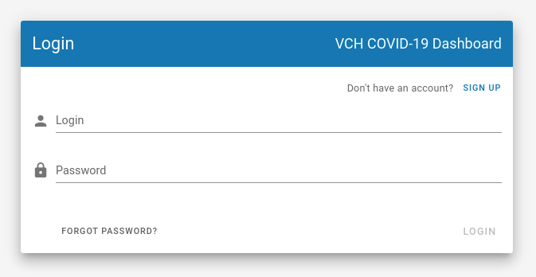

## Password Reset

If you forget your password:

1. Click on the Forgot Password button

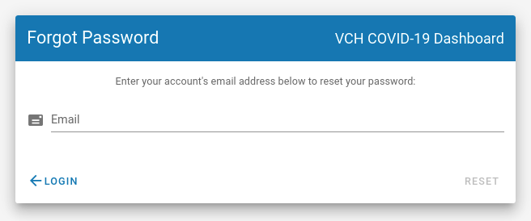

2. Enter your email account used when you registered
3. Click on the RESET button
4. Check your inbox (and spam mailbox)
5. Follow the instructions in the password reset email

# Orders Workflow

There is a slightly different workflow for each of the admin roles. The user journeys for each of the the roles are outlined below.

## Contract Advisors

If a site is contracted and an order is requested for that site the first step in the approval process is for the Contract Advisor to review the order and accept, edit or deny it.

Once the contracted site's order has been reviewed and accepted by the CA it advances to the next step to be reviewed by the Helpdesk.

## Helpdesk Users

When either an order is submitted for a contracted site and then reviewed and approved by a CA or an order is submitted for a non contracted site, the order is listed as pending in the helpdesk users' orders list.

At this point the Helpdesk user can edit, approve or deny the order. Once the order has been approved by Helpdesk it progresses to the next step where Professional Practice or OCC Health Lead finalize the order.

## Professional Practice

Once an order has been approved by Helpdesk it will show in the Professional Practice orders list as a pending order. At this point Professional Practice can edit, approve or deny the PPE items of the form (previously referred to as part A of the paper order form).

Once the PPE items on the form are approved an order is generated in Blast Ramp for the only the those PPE items.

## OCC Health Lead

Once an order has been approved by Helpdesk it will show in the OCC Health Lead orders list as a pending order. At this point OCC Health Leads can edit, approve or deny the N95 items of the form (previously referred to as part C of the paper order form).

Once the N95 items on the form are approved an order is generated in Blast Ramp for the only the those n95 items.

# Orders

## Create an order

1. Click on the Orders menu option

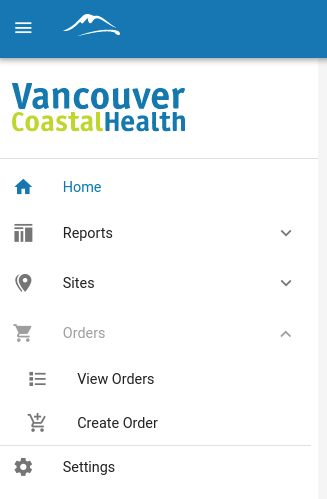

2. Click on the Create Order option

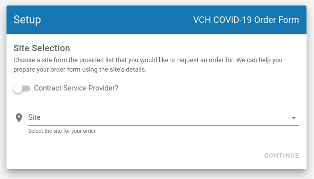

3. Complete the Setup form by first selecting if the site has a Contract Service Provider. When switched on this filters the site list to display only the sites that are contracted. If switched off only sites that are not contracted are listed.

To view all the sites just click in the sites list. You can also start typing in the site field and a list of matching sites will appear.

Select the site you're ordering for and click CONTINUE.

4. The first part of the Create Order form provides details of the site you're ordering for. Please check these details and contact either your Contract Advisor if your site is contracted or Professional Practice if your site is not contracted to update any missing or incorrect information.
5. The next section of the form is where you can select the priority (rush/standard) and enter any specific delivery instructions.

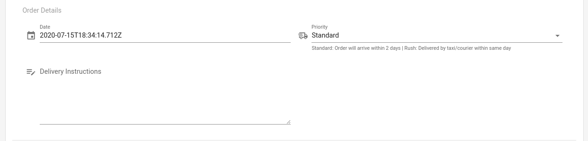

6. The next part of the form is where you enter the quantities for each item required. Please note there is a suggested maximum order for each item along with an indication if the item is available

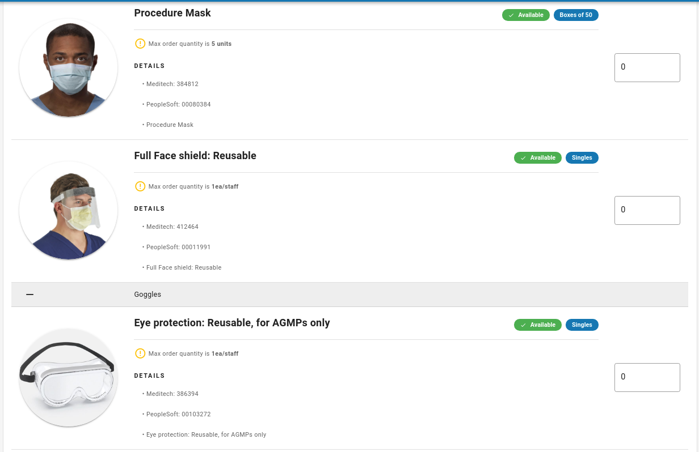

7. Once you've entered quantities for all the items you require scroll to the bottom of the form and click the SAVE button.
8. Having submitted your order you'll then be automatically redirected back to your list of orders

A user can also create an order from the orders list as follows:

1. Click on the orders menu
2. Click on the view orders option
3. Click on the green add button at the top right of the orders grid

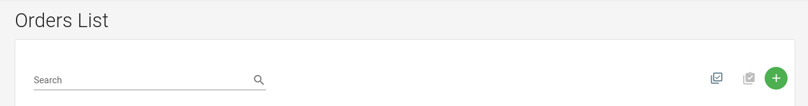

**Note** : If your site is not listed you should contact either you contract advisor if you know the site is contracted or the helpdesk/professional practice if the site is not contracted and they will register the new site with Blast Ramp support.

1. Complete the Setup form (see above)
2. Complete the Create Order form (see above)
3. Having submitted your order you'll then be automatically redirected back to your list of orders

## Create an order (on Behalf of a Site User)

Admin Users can create an order on behalf of a Site User. To do this:

1. Log in as an admin user and follow the instructions above to Create an Order
2. On the Setup page as well as selecting the site you're ordering for, turn on the 'Order for user' option
3. Select the user you're ordering for from the Users list.
4. Click on CONTINUE

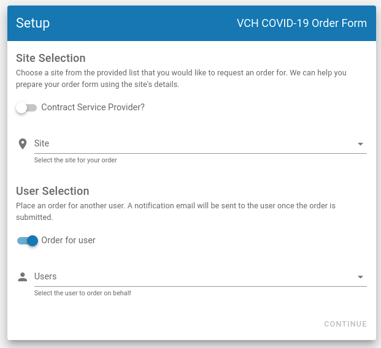

## View an order

1. Click on the orders menu option
2. Click on the view orders option
3. Click on the purple eye icon in the actions column to view an order

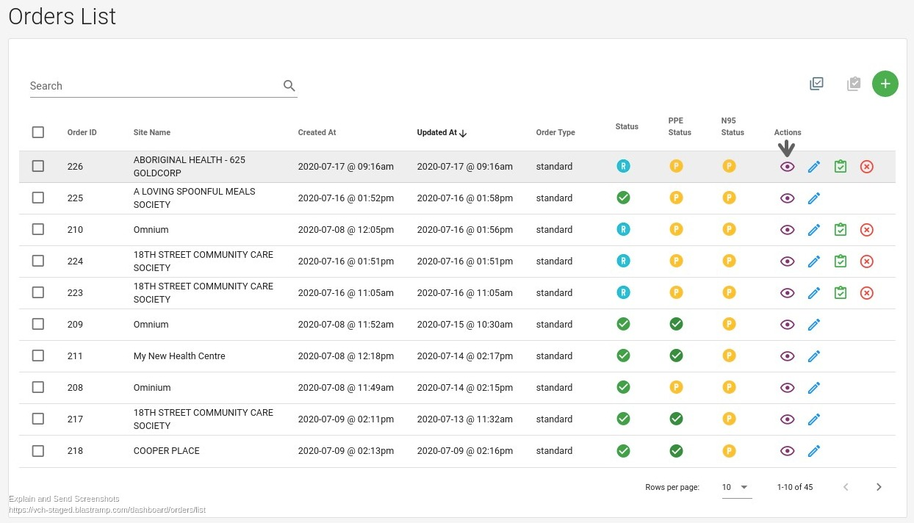

## Edit an order

1. Click on the orders menu option
2. Click on the view orders option
3. Click on the blue pencil icon in the actions column to edit an order

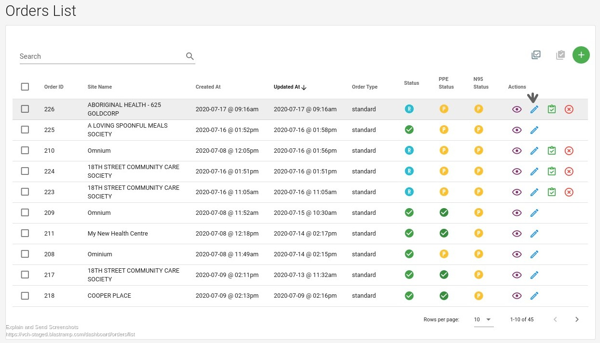 Approve an order

1. Click on the orders menu option
2. Click on the view orders option
3. Click on the green task tick icon in the actions column to approve an order

## Deny an order

1. Click on the orders menu option
2. Click on the view orders option
3. Click on the red cross icon in the actions column to deny an order

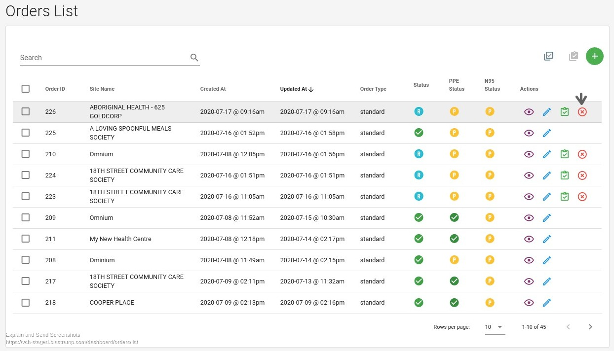
